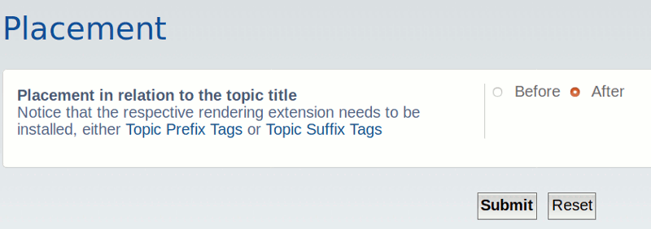
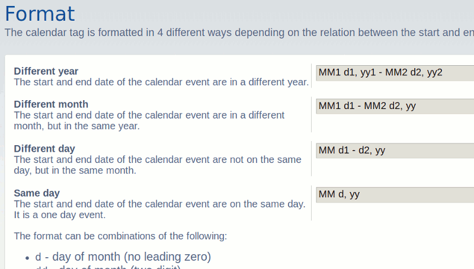
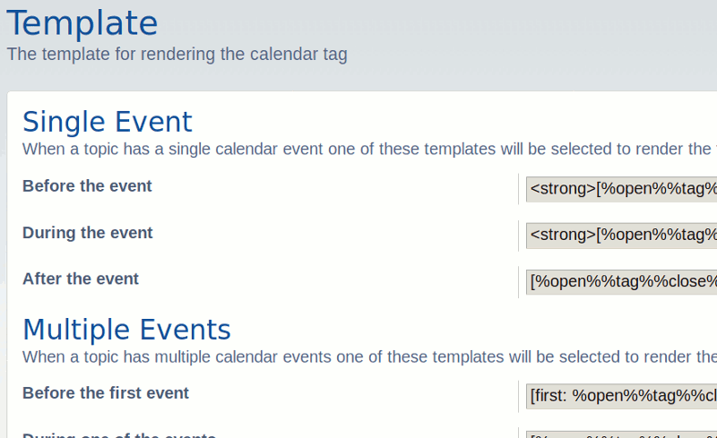

# phpBB Extension - marttiphpbb Calendar Tag

[Topic on phpBB.com](https://www.phpbb.com/community/viewtopic.php?f=456&t=2487156)

## Description

This extension is part of the [Calendar Set](https://github.com/marttiphpbb/phpbb-ext-calendarmono/blob/master/doc/calendar-set.md) and generates (highly configurable) date tags next to the topic titles.

## Requirements

* phpBB 3.2.1+
* PHP 7.1+
* PHP calendar extension (PHP compiled with --enable-calendar)
* phpBB extension [Topic Prefix Tags](https://github.com/marttiphpbb/phpbb-ext-topicprefixtags) or [Topic Suffix Tags](https://github.com/marttiphpbb/phpbb-ext-topicsuffixtags)

## Quick Install

You can install this on the latest release of phpBB 3.2 by following the steps below:

* Create `marttiphpbb/calendartag` in the `ext` directory.
* Download and unpack the repository into `ext/marttiphpbb/calendartag`
* Enable `Calendar Tag` in the ACP at `Customise -> Manage extensions`.

## Uninstall

* Disable `Calendar Tag` in the ACP at `Customise -> Extension Management -> Extensions`.
* To permanently uninstall, click `Delete Data`. Optionally delete the `/ext/marttiphpbb/calendartag` directory.

## Support

* Report bugs and other issues to the [Issue Tracker](https://github.com/marttiphpbb/phpbb-ext-calendartag/issues).

## License

[GPL-2.0](license.txt)

## Screenshots

### Viewtopic

### Viewforum

### MCP

### ACP: Placement

### ACP: Format

### ACP: Template

